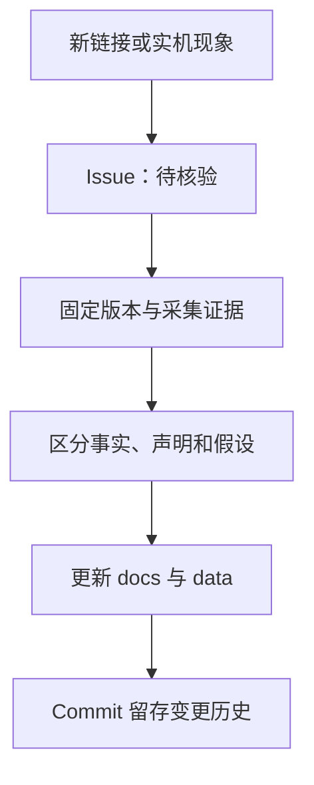

# 记录方法与证据等级

更新时间：2026-08-23

## 为什么使用 Git 仓库

这里需要记录的不是一组静态下载链接，而是会随 ROM、固件、源码分支和实机测试不断变化的判断。将 Markdown、YAML 和 TSV 放在主分支中，可以让每次结论变化都关联到 commit，并通过 diff 看出“哪个事实何时被什么证据推翻或补强”。

GitHub README 适合作为入口；较长内容放入 `docs/`；结构化来源放入 `data/`；Issue Form 负责接收尚未核验的新线索。Wiki 可以做展示，但不作为本仓库的唯一事实源。

## 信息生命周期

## 证据等级

### `DEVICE_VERIFIED`

必须记录：

- 设备型号、代号和适用区域；
- ROM/firmware 完整版本；
- Android、kernel、槽位和 bootloader 状态；
- 测试动作、结果与停止条件；
- 日志或截图是否存在，以及公开前是否完成脱敏；
- 是否产生 flash、wipe、format、slot 或 userdata 写入。

一次设备上的成功不能自动外推到另一版本、另一槽位或另一台设备。

### `HOST_VERIFIED`

适用于源码构建、镜像解析、OTA/payload、AVB、VINTF、哈希和文件结构检查。主机验证只能证明产物内部一致，不能证明真机可启动或数据安全。

### `SOURCE_VERIFIED`

直接读取上游仓库、精确 commit 或官方文档。仅记录默认分支会造成漂移，因此重要结论同时保存：

- 仓库 URL；
- 审计分支；
- 完整 commit SHA；
- 审计日期；
- 当前默认分支与审计分支是否已经分叉。

### `UPSTREAM_CLAIM`

上游 README 声称某项功能可用，但本设备未复测。仓库会保留这个线索，同时禁止把它显示成实机 `PASS`。

### `HYPOTHESIS`、`NOT_TESTED`、`SUPERSEDED`

- `HYPOTHESIS`：解释与现有证据相符，但仍有其他可能。
- `NOT_TESTED`：没有结果；“存在代码/菜单/服务”不等于功能可用。
- `SUPERSEDED`：后续实验已经改变结论；旧记录保留以解释时间线。

## 每条记录的最小字段

| 字段 | 说明 |
|---|---|
| Claim | 一句可证伪的结论 |
| Status | 上述证据等级之一 |
| Scope | 精确设备、版本、槽位和时间 |
| Evidence | 日志、哈希、源码文件或 commit |
| Source | 可访问 URL；私人证据只记类型，不公开原件 |
| Caveat | 不能由该证据推出什么 |
| Last checked | 最后确认来源或状态的日期 |

## 来源优先级

1. 设备原始日志、bootloader/Android 输出和可复算哈希。
2. 官方 AOSP、LineageOS、OnePlusOSS、TWRP/NikGapps 项目文档与源码。
3. 维护者公开仓库中的 commit、issue 和 release。
4. 有完整复现步骤的社区报告，只作为旁证。

本仓库不采纳来源不明的转载、删去上下文的截图、无法定位原帖的网盘说明，也不收录 CoolApk（酷安）来源。

## 二进制与隐私

- Stock OTA、vendor blobs、Google APK 和个人备份不进入仓库。
- 原始日志可能含序列号、手机号、SSID、账户、路径、密钥元数据或应用列表；默认只公开脱敏后的最小片段与结论。
- 自制测试镜像或修复包只有在源码、构建说明、哈希、适用版本、验证状态和回滚方案齐全后，才考虑通过 Release 发布。
- “已生成”与“已实机验证”必须是两个不同状态。

## 更新规则

- 纠错不改写历史：用新 commit 修正，并在文档中指出旧结论为何失效。
- 上游仓库发生变化时，不覆盖历史冻结 SHA；新增 `last_checked` 和当前 HEAD。
- 有破坏性风险的命令默认只作为说明，不构成执行建议。
- 一个 issue 尽量只承载一个来源或一个可复现问题，避免把多个版本的证据混在一起。

