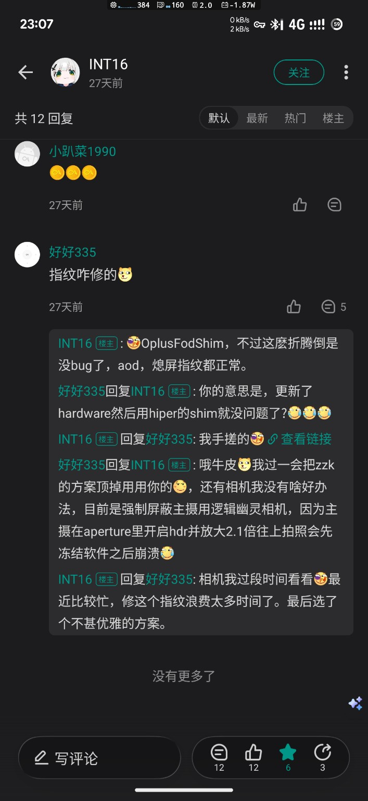
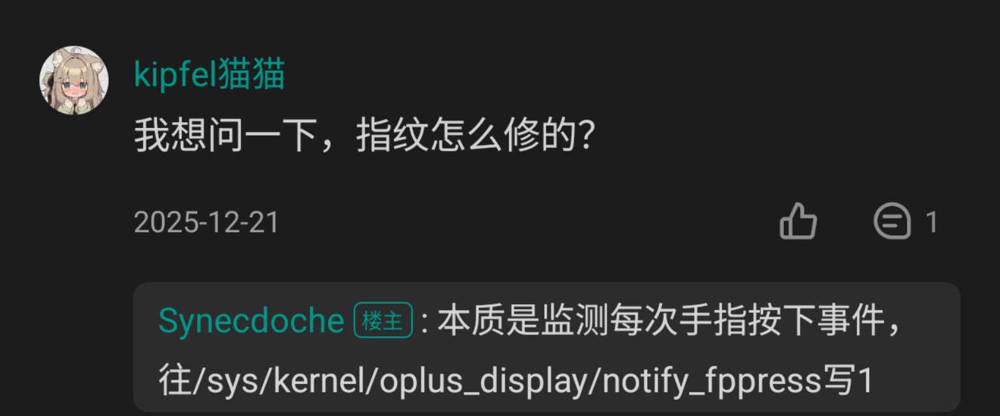
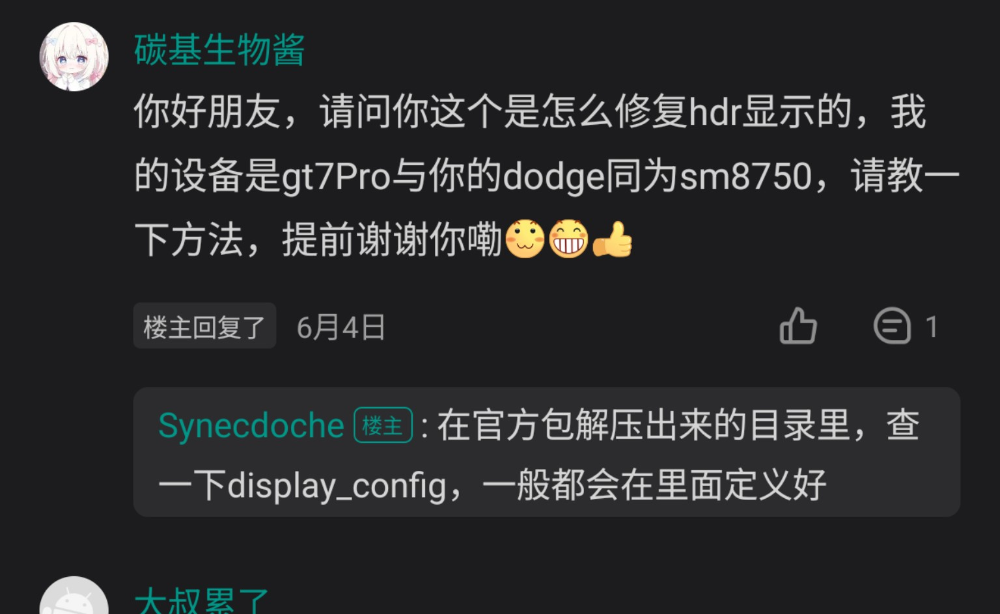

# 待使用／未验证参考

更新时间：2026-08-24

本页是后续构建、适配和排障的候选资料清单，不是已验证教程。除特别注明外，条目仅完成链接登记或社区线索归档，均不能据此宣称 OnePlus 13T（`PKX110` / `pagani`）已经支持相应功能。

## 状态与使用边界

| 状态 | 含义 |
|---|---|
| `LINK_CHECKED` | 链接在登记时可访问；不代表代码已经审计 |
| `COMMUNITY_CLUE` | 来自用户提供的社区文本或截图，只用于提出验证方向 |
| `NOT_REVIEWED` | 尚未逐文件阅读、比对许可证或固定 commit |
| `NOT_TESTED` | 尚未在本仓库记录的 PKX110 环境中测试 |
| `ALREADY_REFERENCED` | 已在其他文档引用，此处只纳入统一入口 |

使用任何源码前，应先固定 commit，并与[成功构建所用冻结版本](lineageos-23.2.md#冻结源码版本)做差异审计。网盘包、ROM 和 recovery 镜像还应另行核对来源、签名或哈希、适用固件、ARB 状态和恢复路径。

## 构建、设备树与硬件层

| 参考 | 计划用途 | 当前状态 | 边界 |
|---|---|---|---|
| [ABNOTF/patches_for_pagani](https://github.com/ABNOTF/patches_for_pagani) | 收集 pagani 构建补丁，和现有 device tree / common tree 做逐项对照 | `LINK_CHECKED + NOT_REVIEWED + NOT_TESTED` | 不整包套用；先确认目标 Android/Lineage 分支和补丁前置条件 |
| [zzkeier/android_device_oneplus_pagani（lineage-23.0）](https://github.com/zzkeier/android_device_oneplus_pagani/tree/lineage-23.0) | 设备树实现参考 | `LINK_CHECKED + NOT_REVIEWED + NOT_TESTED` | 与本仓库已冻结的成功构建来源不是同一基线 |
| [RandomLemon/android_hardware_oplus](https://github.com/RandomLemon/android_hardware_oplus) | OPlus hardware、UDFPS/FOD shim 候选实现参考 | `LINK_CHECKED + NOT_REVIEWED + NOT_TESTED` | 截图与仓库的关联由资料提供者给出；尚未定位决定性 commit 或文件 |
| [LineageOS 官方 OnePlus 13（dodge）构建指南](https://wiki.lineageos.org/devices/dodge/build/) | 参考 LineageOS 官方构建环境、同步、专有文件提取和编译流程 | `LINK_CHECKED + NOT_APPLIED_TO_PAGANI` | `dodge` 是 OnePlus 13，不是 OnePlus 13T 的 `pagani`；不能照搬设备命令、分区或专有文件 |

LineageOS Wiki 当前没有检索到 `pagani` 的官方设备构建页。因此，`dodge` 页面只能作为同代设备的流程示例，实际 manifest、lunch target、proprietary files 和分区配置仍以 pagani 源码为准。

## 指纹 / UDFPS 线索

### OplusFodShim 与 hardware/oplus

用户提供的讨论截图中，`INT16` 将其方案概括为 `OplusFodShim`，并称调整后 AOD、熄屏指纹正常；同一讨论还提到用该方案替换另一套实现。该说法目前只记为 `COMMUNITY_CLUE + NOT_TESTED`，候选代码入口是 [RandomLemon/android_hardware_oplus](https://github.com/RandomLemon/android_hardware_oplus)。

截图里另有“相机在 Aperture 开启 HDR、放大超过 2.1 倍后可能冻结并崩溃”的旁支描述。它与下面的“显示 HDR 配置”不是同一个问题，本页不据此建立相机结论。

### `notify_fppress` 事件桥接

另一张截图中，`Synecdoche` 将指纹修复思路概括为：监测每次手指按下事件，并向 `/sys/kernel/oplus_display/notify_fppress` 写入 `1`。这与现有 [LineageOS UDFPS 根因边界](lineageos-23.2.md#udfps-根因边界)中的待查节点相符，但仍缺少完整实现和本机回归证据。

后续若采用这条线索，至少还要核对 finger-down/up 生命周期、节点权限、ueventd、SELinux、HBM、AOD/熄屏路径，以及 `session.onUiReady()` 是否真实到达 HAL；不能只凭一次写入就标记指纹为修复。

## 显示 HDR 线索

用户提供的跨设备 SM8750 讨论中，`Synecdoche` 建议在官方包解压目录中搜索 `display_config`，认为 HDR 显示相关定义通常位于其中。

该讨论的提问设备不是 OnePlus 13T，且截图没有原帖 URL、目标文件路径或 patch，因此状态为 `COMMUNITY_CLUE + NOT_TESTED`。后续只把它作为比对 `.501` 产品配置、display HAL/mapper 和当前 device tree 的搜索入口。

## Root、完整性与隐藏相关线索

以下内容来自用户提供的 DerpFest 社区文本，统一标记为 `COMMUNITY_CLAIM + NOT_REVIEWED + NOT_TESTED`：

- 该文本称其 OnePlus 13T DerpFest 构建已内置 KernelSU-Next 与 SUSFS，并建议通过对应 KSU 模块隐藏部分 AOSP/Lineage 特征。
- 基础组合提及 Zygisk 与 LSPosed；出于实现透明性考虑，另提到 NeoZygisk 与 Vector。
- 针对解锁后 TEE/完整性问题，文本列出 TEESimulator-RS、TA-enhanced、PlayIntegrityFix-inject-s 与 `keybox.xml`。
- HMA-OSS 被列为隐藏可疑应用的候选工具，可导入现成预设。
- 文本观察到：root 环境下启用 Scene 的无障碍服务可能触发部分应用检测；出现问题时可把关闭该无障碍服务作为排查变量。

配套文件仅登记原始外链：[123 云盘打包链接（密码 `INT8`）](https://1817114020.share.123pan.cn/123pan/8MYVVv-QFmDh?pwd=INT8)。本仓库没有下载、检查或重新上传该包，也没有确认其中各文件的项目来源、版本、许可证、哈希或安全性。

这组资料只用于研究和兼容性排障。完整性绕过可能降低设备安全性、违反应用或服务规则；不得上传、共享或复用来源不明的私有 keybox。收录工具名称不代表本仓库推荐规避金融、支付、企业管理或反作弊系统的安全控制。

## Recovery 与 ROM 文件入口

| 参考 | 计划用途 | 当前状态 | 边界 |
|---|---|---|---|
| [kmiit/twrp_device_oplus_sm87xx](https://github.com/kmiit/twrp_device_oplus_sm87xx) | TWRP 设备树和 SM8750 recovery 实现参考 | `ALREADY_REFERENCED` | 已用于 [TWRP 研究文档](twrp.md)；新提交不增加实机结论 |
| [OnePlus pagani files on SourceForge](https://sourceforge.net/projects/oneplus-pagani/files/) | 国外 OnePlus 13T 类原生 ROM/文件发布入口 | `LINK_RECORDED + NOT_REVIEWED + NOT_TESTED` | 这是文件目录，不是兼容性或安全背书；下载前逐项确认维护者、版本、校验值和安装说明 |

## 后续采用顺序

1. 先固定候选仓库的 branch、commit 与许可证。
2. 与本仓库冻结的 LineageOS 23.2 manifest 做最小 diff，按“指纹、显示、相机、构建补丁”拆分。
3. 只在可回滚的测试分支构建；主机验证和设备验证分别记录。
4. 指纹与 HDR 必须补齐日志、触发条件和回归矩阵，不能仅以界面出现或单次成功判定。
5. 外部 ROM、recovery、root/隐藏模块和网盘包在完成来源与哈希审计前，不进入仓库 Release，也不提升为已验证方案。
